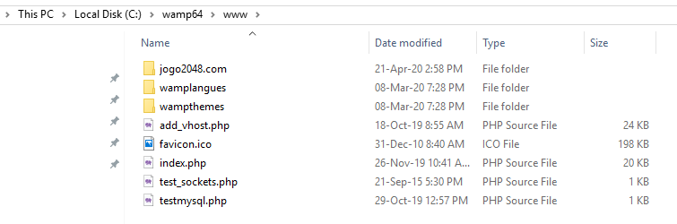
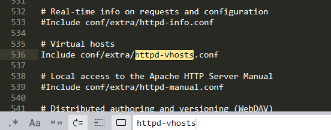
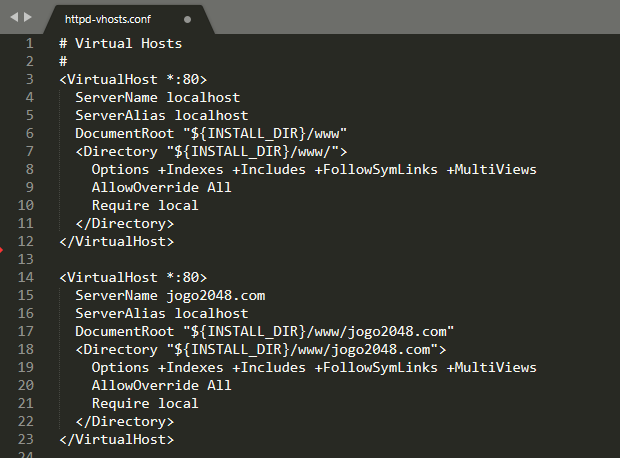
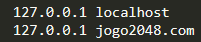

# Upando jogo 2048 no localhost
> Relatório que explica como subir o jogo "2048" em um virtual host usando o Apache do WampServer.

## Instalação do WampServer
Para subir o jogo no localhost no windows é necessário o uso do Apache, que pode ser instalado individualmente ou através de um pacote chamado WampServer, que além de ter o Apache também possui PHP, MySQL e MariaDB.

**Pontos importantes antes da instalação**
* **Não** instale o WampServer sobre uma versão já existente.
* Instale o WampServer numa pasta na raíz do disco local, por exemplo `C:\wamp`.
* Caso tenha Skype, feche-o durante a instalação, pois este programa também ouve a porta 80 assim como o WampServer.
* Execute o instalador como admnistrador.
* Instale todos os pacotes C++ exigidos pelo WampServer:

   **Se seu windows é 64 bits você deverá instalar todos os pacotes 64 bits (x64) e 32 bits (x86)**
   * VC9 Packages (Visual C++ 2008 SP1)
      * [x86](https://www.microsoft.com/en-us/download/details.aspx?id=29)
      * [x64](https://www.microsoft.com/en-us/Download/confirmation.aspx?id=15336)
      
   * VC10 Packages (Visual C++ 2010 SP1)
      * [x86](http://www.microsoft.com/en-us/download/details.aspx?id=8328)
      * [x64](http://www.microsoft.com/en-us/download/details.aspx?id=13523)
      
   * VC11 Packages (Visual C++ 2012 Update 4)
      * [x86 e x64](http://www.microsoft.com/en-us/download/details.aspx?id=30679)
      
   * VC13 Packages Update 5 (Visual C++ 2013)
      * [x86 e x64](https://support.microsoft.com/en-us/help/4032938/)
      
   * VC16 Redistribuable (Visual C++ 2015-2019)
      * [x86](https://aka.ms/vs/16/release/VC_redist.x86.exe)
      * [x64](https://aka.ms/vs/16/release/VC_redist.x64.exe)

   * [Todos os pacotes x86](http://wampserver.aviatechno.net/files/vcpackages/all_vc_redist_x86.zip)
   * [Todos os pacotes x86 e x64](http://wampserver.aviatechno.net/files/vcpackages/all_vc_redist_x86_x64.zip)

O download do arquivo executável do WampServer pode ser obtido neste [link](http://wampserver.aviatechno.net).
Após acessar o site e baixar o arquivo, basta executá-lo e seguir os procedimentos de instalação.

Após a instalação, execute o WampServer, aguarde o ícone dele ficar verde na barra de tarefas e abra o localhost no seu navegador. A página do WampServer deverá aparecer, indicando que a instalação foi realizada corretamente.

## Hospedando o jogo
Após a instalação do WampServer, vá até o disco local e entre na pasta onde foi instalado o WampServer (por padrão é `wamp64`) e então entre na pasta `www`. Nessa pasta, copie e cole a pasta `jogo2048.com` que está neste repositório.

Feito isso, volte à pasta do WampServer e vá em `bin > apache > apache2.4.41 > conf`. Detalhe que a pasta apache2.4.41 pode mudar de nome dependendo da versão do seu apache, entretanto, esta pasta é a única dentro da pasta `apache`. Na pasta `conf`, abra o arquivo `httpd.conf` com um editor de texto e procure onde está escrito `httpd-vhosts`. Caso esta linha esteja comentada, ou seja, com um `#` na frente, apague o `#` e salve o arquivo.

Após salvar o arquivo, feche-o e volte à pasta `conf`, nessa pasta há uma pasta chamada `extra`, abra-a e em seguida abra o arquivo `httpd-vhosts.conf` com um editor de texto. Nesse arquivo, copie e cole logo abaixo o texto que está nele, editando os campos `ServerName`, `DocumentRoot` e `Directory` conforme a imagem abaixo.

Por fim, volte ao disco local e vá em `Windows > System32 > drivers > etc`. Nesta pasta abra o arquivo `hosts` com o editor de texto **como admnistrador** (abra o editor de texto como admnistrador e então abra o arquivo hosts através do editor de texto). Neste arquivo, após `127.0.0.1 localhost`, coloque `127.0.0.1 jogo2048.com` e salve.

Com isso, basta reiniciar o WampServer na barra de tarefas, para isso clique no ícone dele com o botão esquerdo e então clique em "Reiniciar todos os serviços". Após o WampServer reiniciar, vá na url `jogo2048.com` no seu navegador, que deverá mostrar o jogo que hospedamos.
